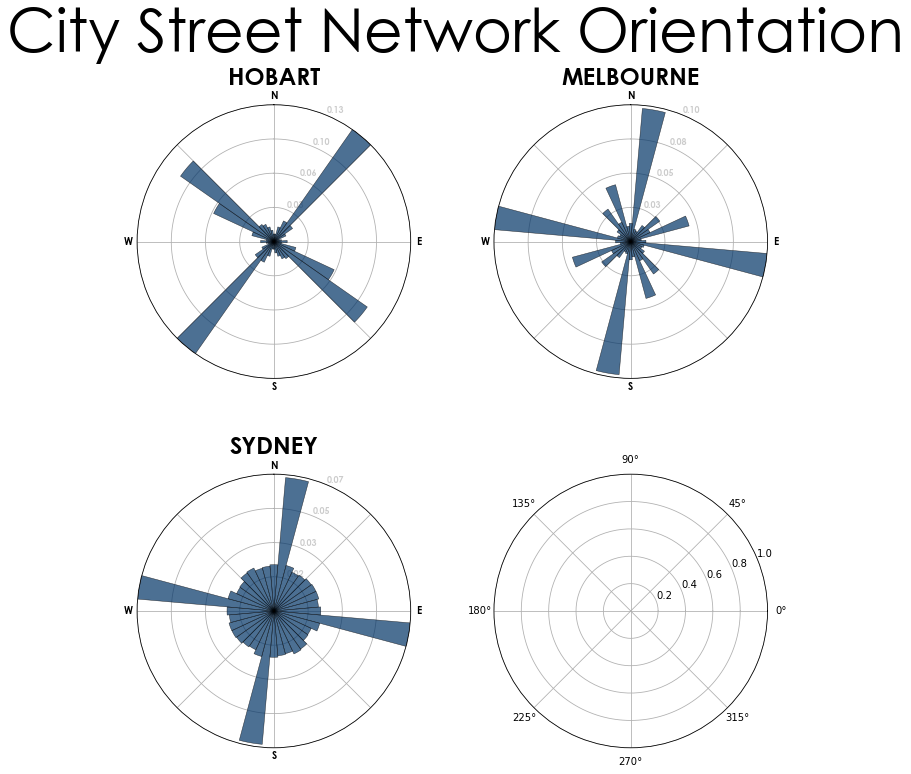
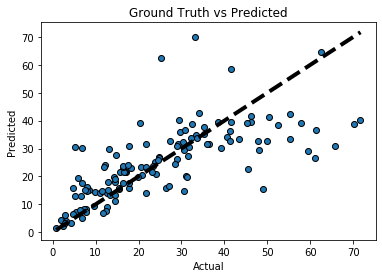
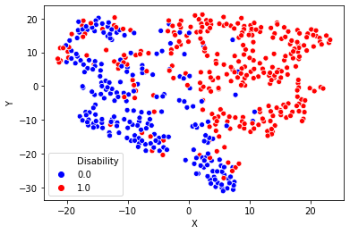
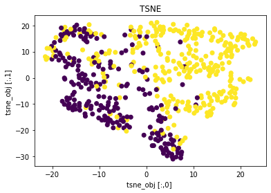

# python_journey
These codes are part of my journey learning python. 

The first part focusses on geospatial analysis and use the osmnx library. The tutorial paper is available [here](https://www.frontiersin.org/articles/10.3389/fneur.2019.00743/full). The [Brisbane.ipynb](./Brisbane.ipynb) python notebook deals with journey from Westin Hotel to surrounding building within 500 metres radius. A second example uses codes provided from osmnx for examining street network orientation in Australian Capital Cities. The AustCities-Copy1.ipynb note book is available in gh-pages.  

The second part focusses on machine learning and use sklearn. Random forest is , a supervised machine learning method related to decision tree analysis, which employed random selection of covariates and patients from the dataset to create multiple trees. This form of ensemble learning utilises ‘wisdom of the crowd’ to create the model. This example illustrates the use of regression with random forest and a plot of observed vs predicted is provided in RFstandfirm.ipynb notebook. An example with random forest classification is provided in the DrivingReg.ipynb notebook. This example comes with demo of creation of GUI for testing new data using the model created by random forest. 

The third part focusses on manifold learning and uses sklearn manifold tsne. The T-distributed Stochastic Neighbor Embedding example is provided below. This is a low dimensional representation of the thrombectomy trial data. The file also contains illustration about merging pandas data frame and provides 3 types of plot: seaborn, matplotlib and plotnine-ggplot style.

The seaborn plot is shown. 

The matplotlib plot of the same data is shown.

The plotnine plot of the same data is shown. 

